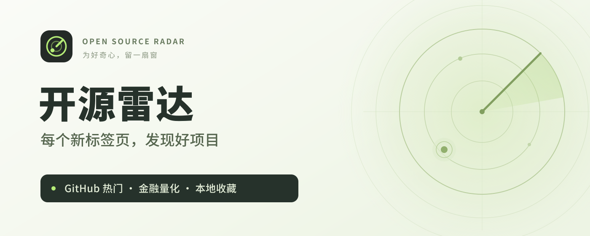
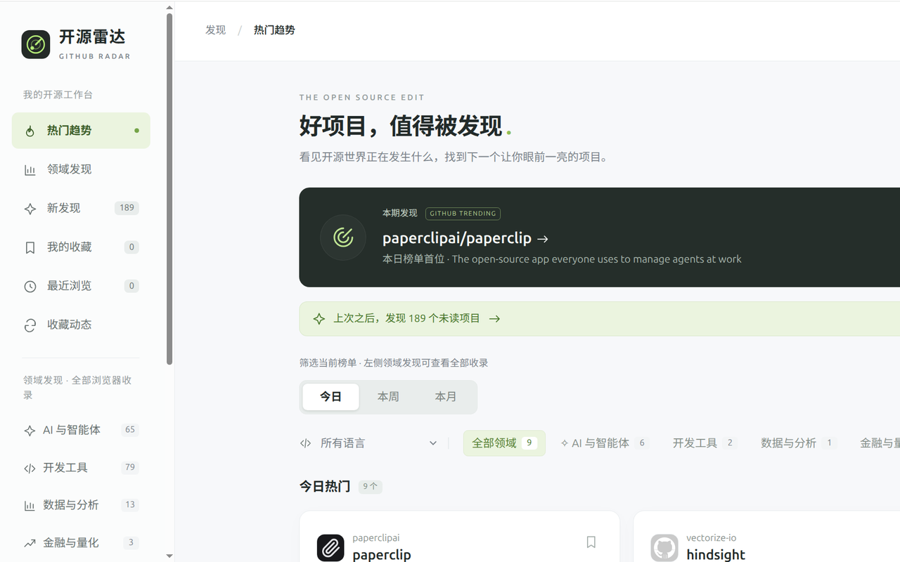

# 开源雷达 · GitHub Radar



把 GitHub 热门项目、收藏和阅读笔记放进新标签页。给好奇心留一扇窗，也给发现过的好项目留一个位置。

**基础扩展独立运行，无需账号、API 密钥或本机服务。** 它直接读取 GitHub 公开榜单，将个人资料保存在当前浏览器。需要桌面入口或中文 AI 解读时，也可以运行仓库提供的本机 Web 服务。

[下载安装包](https://github.com/ydxred/github-radar/releases/latest) · [安装指南](docs/浏览器扩展安装.md) · [反馈问题](https://github.com/ydxred/github-radar/issues) · [隐私说明](https://github-radar-ydxred.yangxxq.chatgpt.site/privacy.html)

> Chrome 应用商店尚未确认公开发布。目前提供手动安装包和源码安装方式；GitHub 发布包不代表已经通过商店审核。

## 看起来是什么样



上图来自实际安装后的页面，已裁切为展示区域。支持浅色、深色主题，以及卡片、列表两种布局。

## 可以做什么

- **发现热门项目**：查看日榜、周榜、月榜，按编程语言筛选；显示来源、更新时间和缓存状态。
- **按领域慢慢逛**：汇总已收录项目中的 AI 与智能体、开发工具、数据分析、金融量化、学习资源等内容。分类由名称和简介推断，可以重叠，也可能遗漏。
- **建立自己的清单**：收藏、记录笔记、标为已读、隐藏项目，再从最近浏览中找回来。收藏是本地清单，不会操作 GitHub 账号的 Star。
- **看真实变化**：保留采集时观察到的榜单快照，查看收藏项目的公开版本动态。“新发现”表示本资料库首次收录，不代表项目刚刚创建。
- **整理与备份**：搜索当前列表中的项目和笔记，导入、导出个人资料 JSON，或从内置备份恢复。
- **按需中文解读**：可选连接自己的 Codex，阅读项目用途、适用人群、开始方式、使用门槛和注意事项。本机 Web 也支持手动选择 Qwen 本地推理。

搜索作用于当前列表或本地收录库，不是 GitHub 全站搜索。历史只使用实际采集记录，不补造过去的数据；日、周、月榜的新增 Star 不直接混为同一个比较口径。

## 选择使用方式

| | 独立 Chrome 扩展 | 本机 Web 服务 |
| --- | --- | --- |
| 打开方式 | 新建普通标签页 | 访问本机地址；Ubuntu 可安装桌面入口 |
| 日常依赖 | Chrome 120+、可访问 GitHub 的网络 | Node.js 24+、运行中的服务 |
| 资料存放 | 当前浏览器的 IndexedDB | 本机 `data/radar.sqlite` |
| 自动采集 | 至少一个雷达标签页打开时运行 | 服务运行且电脑未休眠时运行 |
| 中文解读 | 可选连接本机服务，使用自己的 Codex | 可选 Codex 或 Qwen 本地模型 |

两种方式的资料库**分别保存，不自动同步**。可通过资料 JSON 搬移收藏和笔记。基础功能均不需要账号或密钥。

## 安装独立扩展

**直接安装**：在 [Releases](https://github.com/ydxred/github-radar/releases/latest) 下载 `github-radar-chrome-v2.0.0.zip`，解压到长期保留的文件夹。使用安装包不需要 Node.js 或 Python。

**从源码构建**：需要 Node.js 24 或更新版本及 npm。

```bash
git clone https://github.com/ydxred/github-radar.git
cd github-radar
npm ci
npm run build:extension
```

1. 在 Chrome 地址栏打开 `chrome://extensions/`，开启“开发者模式”。
2. 点击“加载已解压的扩展程序”，选择安装包解压目录，或源码生成的 **`browser-extension/`**。所选文件夹应直接包含 `manifest.json`。
3. 新开普通标签页。如果 Chrome 询问是否保留新标签页更改，选择保留开源雷达。

请保留加载目录，Chrome 后续仍会读取其中的文件。若已有其他新标签页扩展，需在 Chrome 中选择启用哪一个。更新前先导出资料，更新文件后在扩展卡片点击“重新加载”。详细步骤见 [安装与资料迁移指南](docs/浏览器扩展安装.md)。

## 日常使用与采集

首次打开会先加载当前榜单，再逐步补充领域发现。默认关注总榜及 Python、TypeScript、JavaScript、Go、Rust、Java、C++ 的日榜和周榜，共 16 个榜单，每两小时检查一次；可在设置中调整范围、间隔或暂停采集。

扩展的采集随标签页运行。关闭全部雷达标签页、退出浏览器或休眠后会暂停；浏览器冻结标签页也可能推迟执行。再次打开后继续采集，不会补齐错过的所有时刻。

GitHub 匿名 API 有额度限制，可能影响详情与收藏动态刷新；设置中可查看连接和额度状态。有缓存时会保留旧数据并标明状态。收藏动态每轮最多检查 10 个项目，只展示接口返回范围内的近期稳定版本，不代表完整发布历史。

## 可选：运行本机 Web

完成克隆和 `npm ci` 后，在项目根目录运行：

```bash
npm start
```

打开 **http://127.0.0.1:4317/**。服务只监听本机回环地址，默认不开放到局域网或公网。终端关闭或进程停止后，网页和后台采集停止，磁盘中的资料仍保留。

本机数据默认放在项目的 `data/` 目录，可在启动前设置 `GITHUB_TOP_DATA` 改用其他目录。扩展的可选 Codex 连接固定使用 `127.0.0.1:4317`，需要保留该端口。

**Ubuntu 桌面入口**：适用于 `systemd --user`，需要 `curl`、Python 3 和常用 XDG 桌面工具。

```bash
bash scripts/install-desktop.sh
bash scripts/open-web.sh --check
```

脚本创建“开源雷达 Web”桌面入口及用户服务，并启用登录后的服务启动。点击入口会先确保服务就绪再打开网页；桌面如提示信任启动器，请允许启动。可用 `systemctl --user status github-top.service` 查看状态，或用 `systemctl --user disable --now github-top.service` 停止服务并取消自启动。移动项目或 Node.js 后，应重新安装入口。本机服务与桌面脚本主要在 Ubuntu 上验证。

## 可选：中文 AI 解读

基础榜单、收藏、笔记与备份都不依赖 AI。**打开页面不会自动生成解读；点击生成才调用所选模型。** 结果会缓存，重复查看已有结果无需再次生成；手动重新生成会发起新的调用。

### 使用自己的 Codex

1. 自行安装 Codex CLI，使用自己的 ChatGPT 账号登录，并确保有可用 Codex 额度。
2. 启动本机 Web 服务，在网页设置中启用 Codex 解读；它也是本机 Web 的默认解读方式。
3. 在源码安装的扩展设置中点击“连接本机 Codex”，主动授予访问 `http://127.0.0.1:4317/*` 的可选权限。
4. 打开项目详情，点击“用 Codex 解读”生成内容。

扩展只向本机服务传入公开项目标识及生成选项；服务读取公开 README，再通过本机 Codex CLI 请求 OpenAI 云端模型。**这会使用你的 Codex 额度，不是离线推理，也不需要额外填写 API Key。** 当前接入仅接受 ChatGPT 登录，不支持 API Key 登录模式。

私人笔记、收藏列表和 GitHub Token 不作为解读输入。程序在只读环境中约束 CLI 进行资料解读，不执行 README 中的安装命令；每次最多读取前 24,000 个字符，截断时会注明节选。结果可能有遗漏，应结合原项目文档判断。

“断开并撤销权限”会停止扩展访问本机服务，不会删除服务端缓存。配套服务校验本地构建清单对应的扩展来源；以上步骤适用于源码安装版，未来商店版可能使用不同标识，需要另行适配。官方参考：[身份验证](https://learn.chatgpt.com/docs/auth)、[非交互模式](https://learn.chatgpt.com/docs/non-interactive-mode)。

### 使用 Qwen 本地推理

本机 Web 提供手动选择的 Qwen 模式，独立扩展目前不连接该模式。安装脚本适用于 Ubuntu / Linux x86_64，以固定版本和 SHA256 校验下载官方模型及运行时：

```bash
python3 scripts/install-local-model.py
```

安装后，在本机 Web 设置中选择“本机离线模型”。当前使用 **Qwen3-1.7B-Q8_0**（模型约 1.83 GB）和 **llama.cpp b11207**，CPU 6 线程推理，需要数 GB 可用内存。模型默认放在 `~/.local/share/github-top/local-ai`，可用 `GITHUB_TOP_AI_HOME` 修改；首次生成时启动，空闲 5 分钟后退出。

此模式读取清理 HTML 后的 README 前 6,000 个字符。下载和首次获取 README 需要联网，推理在本机完成。**Qwen 失败时不会自动切到 Codex 消耗额度，Codex 失败时也不会擅自切换模型。**

## 数据与隐私

扩展不接入广告或统计分析 SDK，不读取其他标签页、浏览器全局历史、Cookie、密码或 Codex 登录凭证。“最近浏览”仅记录在雷达内打开过的项目。网络请求包括 GitHub 公开榜单与 API、作者头像，以及主动启用后的本机服务；外部服务会收到正常网络连接信息。

- **个人资料**：扩展在当前浏览器保存收藏、笔记、阅读标记、最近浏览和偏好；最近浏览最多 100 项，个人资料按导出 JSON 的 UTF-8 大小限制为 8 MiB，单条笔记最多 3,000 字符。
- **内置备份**：扩展自动、手动及恢复前备份合计最多 14 份，仅覆盖个人资料，不含收录库、公开缓存、采集设置或连接授权。卸载扩展或清除浏览器数据可能同时删除资料与备份，**请定期导出 JSON 到电脑**。
- **本机 Web**：收藏、笔记、快照等在 `data/radar.sqlite`，SQLite 备份在 `data/backups/`；设置、可选 GitHub Token、模型缓存分开保存，不在资料 JSON 内。
- **迁移**：JSON 导入采用合并方式，保留已有非空笔记。导出适合迁移个人资料，不是全部采集历史或运行环境的镜像。

完整说明见 [隐私政策](https://github-radar-ydxred.yangxxq.chatgpt.site/privacy.html)，扩展内也附有可离线打开的隐私页面。

## 开发与打包

安装依赖后先构建，再运行检查与测试；打包还需要 Python 3：

```bash
npm ci
npm run build:extension
npm run check
npm test
npm run package:extension
```

最后一个命令会重新构建并生成 `dist/开源雷达-独立本地安装-2.0.0.zip` 和 `dist/开源雷达-商店上传-2.0.0.zip`。独立安装包保留固定开发版标识，商店上传包移除开发版公开 key。该 key 用于维持标识，不是登录密钥；不同扩展标识的资料互不相通，切换渠道前请先导出。

源码按职责放在 `extension/`（扩展数据与请求）、`public/`（共用界面）、`server/`（可选本机服务）、`scripts/`（构建与安装）、`tests/`（回归测试）和 `docs/`（使用说明）。`browser-extension/`、`dist/` 是构建产物；`data/`、本机部署记录、模型和凭证不应提交。

测试覆盖解析、额度处理、导入导出、备份恢复、跨标签页协调、界面状态和可选 AI 接口。自动测试不替代真实扩展安装验收，也不表示通过商店审核。

## 常见问题与反馈

**不开账号影响收集吗？** 公开 Trending 榜单可直接查看；匿名 API 额度主要影响详情和收藏动态，限制时会提示并等待恢复。本机 Web 可选配置 GitHub Token，独立扩展不要求或保存 Token。

**领域列表很少，或断网了？** 首次收录需要时间，可保持一个雷达标签页打开或在设置中手动采集。断网时仍能查看已保存资料及可用缓存；新榜单、详情和 Codex 云端解读需要网络。

**本机服务或 Codex 连不上？** 确认 Node.js 24+、服务正在运行、4317 端口未被其他程序占用；Codex 需在网页设置启用且 CLI 已使用 ChatGPT 登录。扩展连接使用仓库构建标识；重新构建后，必要时重启服务。

欢迎通过 [GitHub Issues](https://github.com/ydxred/github-radar/issues) 反馈版本、复现步骤与错误提示，请勿上传私人笔记、凭证或完整个人备份。维护者：**ydxred** · [xxsqqtom@gmail.com](mailto:xxsqqtom@gmail.com)
